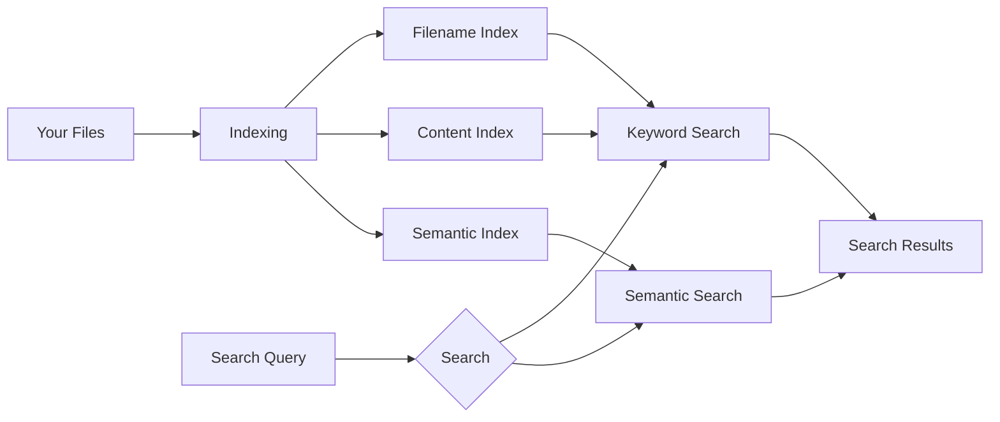

<p align="center">
  
</p>

<h1 align="center">fanSearch</h1>

<p align="center">
  <strong>Multilingual Local AI Search for Windows</strong>
</p>

<p align="center">
  Search your files by meaning, filename, and content.
  <br>
  Your files stay on your computer.
</p>

<p align="center">
  <a href="YOUR_MICROSOFT_STORE_URL">
    <strong>Get fanSearch from Microsoft Store</strong>
  </a>
  &nbsp;&nbsp;·&nbsp;&nbsp;
  <a href="YOUR_WEBSITE_URL">
    Website
  </a>
</p>

<p align="center">
  🌍 Multilingual &nbsp;·&nbsp;
  🧠 Semantic Search &nbsp;·&nbsp;
  🔍 Keyword Search &nbsp;·&nbsp;
  📄 File Content Search &nbsp;·&nbsp;
  🔒 Local & Private
</p>

<br>

---

# What is fanSearch?

**fanSearch** is a local AI-powered file search application for Windows.

It combines **semantic search, keyword search, filename search, and file content search** in one place.

Instead of remembering exactly what a file was called, you can describe what you are looking for in natural language.

For example:

> "Documents about my child's picture books"

or:

> "The experiment data about vegetable peeling"

fanSearch can use semantic matching to find relevant files, even when the exact words in your query do not appear in the filename.

Your files stay on your computer.

---

# Why fanSearch?

Traditional file search usually starts with one question:

> **"What is the file called?"**

fanSearch lets you search from another direction:

> **"What am I looking for?"**

It combines different ways of finding files:

| Search | What it does |
|---|---|
| 🧠 Semantic Search | Finds files based on meaning and context |
| 🔍 Keyword Search | Finds exact words and terms quickly |
| 📄 File Content Search | Searches inside supported file contents |
| 🗂️ Filename Search | Searches file and folder names |
| 🧹 Duplicate File Detection | Helps identify duplicate files |
| 🔄 Search While Indexing | Start searching while files are being indexed |

---

# 🧠 Semantic Search

## Search by meaning, not just exact words

Semantic search allows you to describe what you are looking for naturally.

You don't always need to remember the exact filename or wording inside a document.

For example:

> "Documents about my child's picture books"

or:

> "Files about the vegetable peeling experiment"

fanSearch uses semantic matching to find content that is conceptually related to your query.

<p align="center">
  
</p>

<details>
<summary><strong>▶ Watch Semantic Search Demo</strong></summary>

<br>

<p align="center">
  <a href="YOUR_YOUTUBE_SEMANTIC_SEARCH_URL">
    
  </a>
</p>

<p align="center">
  Click the image to watch the demonstration on YouTube.
</p>

</details>

---

# 🌍 Multilingual Semantic Search

fanSearch is not limited to Chinese.

Its semantic search capability is designed for **multilingual use**, allowing users to search files using different languages supported by the underlying semantic model.

This makes fanSearch useful for collections containing:

- English documents
- Chinese documents
- Japanese documents
- Korean documents
- Technical documentation
- Multilingual PDFs
- Mixed-language personal files

The actual search experience depends on the language coverage and characteristics of the underlying semantic model.

---

# 🔍 Keyword Search

## Fast search when you know what you're looking for

Semantic search is powerful, but sometimes you already know the exact word.

That's where traditional keyword search comes in.

Search for:

- filenames
- folder names
- document text
- technical terms
- names
- numbers
- symbols
- exact phrases

fanSearch combines keyword search with semantic search, so you can use the method that fits the task.

<p align="center">
  
</p>

<details>
<summary><strong>▶ Watch Keyword Search Demo</strong></summary>

<br>

<p align="center">
  <a href="YOUR_YOUTUBE_KEYWORD_SEARCH_URL">
    
  </a>
</p>

<p align="center">
  Click the image to watch the demonstration on YouTube.
</p>

</details>

---

# 📄 File Content Search

## Search inside your files

Finding a file is often not enough.

Sometimes the information you need is buried inside the file itself.

fanSearch can index supported file contents and make them searchable.

This allows you to search not only:

**Filename**

but also:

**File Content**

and:

**Semantic Meaning**

So you don't have to switch between separate filename and content search tools.

---

# 🧹 Duplicate File Detection

## Find files you may already have

Over time, files are often copied, downloaded, exported, and moved between folders.

You may end up with files such as:

```text
document.pdf
document (1).pdf
document-final.pdf
document-final-2.pdf
```

fanSearch can help identify duplicate files so you can review them and decide what to keep.

<p align="center">
  
</p>

<details>
<summary><strong>▶ Watch Duplicate File Detection Demo</strong></summary>

<br>

<p align="center">
  <a href="YOUR_YOUTUBE_DUPLICATE_URL">
    
  </a>
</p>

<p align="center">
  Click the image to watch the demonstration on YouTube.
</p>

</details>

---

# 🔄 Search While Indexing

## You don't always have to wait

When a large collection of files is being indexed, waiting for the entire process to finish can be inconvenient.

fanSearch is designed so that you can begin working with the search system while indexing is still progressing.

As more files are indexed, more searchable content becomes available.

<p align="center">
  
</p>

<details>
<summary><strong>▶ Watch Search While Indexing Demo</strong></summary>

<br>

<p align="center">
  <a href="YOUR_YOUTUBE_INDEXING_URL">
    
  </a>
</p>

<p align="center">
  Click the image to watch the demonstration on YouTube.
</p>

</details>

---

# 🔒 Local & Private

## Your files stay on your computer

fanSearch is designed as a **local Windows application**.

Your local files do not need to be uploaded to a remote search service just to search your own computer.

This makes fanSearch suitable for users who care about:

- Local data
- Privacy
- Personal documents
- Work documents
- Offline use
- Large local file collections

> **Your files stay on your computer. Your search stays with them.**

---

# 🪟 Built for Windows

fanSearch is designed specifically for Windows.

It works directly with your local files and folders while adding semantic search capabilities to traditional file search.

---

# ⚙️ How It Works

At a high level, fanSearch combines several search technologies:



The goal is not to replace traditional search with AI.

Instead, fanSearch combines:

**Traditional Search + Semantic Search**

so you can use whichever method fits the task.

---

# 📦 Supported File Types

Current support includes:

- TXT
- Markdown
- HTML
- PDF
- Other supported text-based documents

Supported formats may change between releases.

---

# 🚀 Getting Started

1. Install fanSearch.
2. Select the folders you want to search.
3. Let fanSearch index your files.
4. Search using keywords or natural language.
5. Open the file directly from the search results.

You can start with a small folder and gradually add more locations.

---

# 🎥 Video Demonstrations

All demonstrations are available on YouTube.

<details>
<summary><strong>▶ Semantic Search</strong></summary>

<br>

<a href="YOUR_YOUTUBE_SEMANTIC_SEARCH_URL">
  
</a>

</details>

<br>

<details>
<summary><strong>▶ Keyword Search</strong></summary>

<br>

<a href="YOUR_YOUTUBE_KEYWORD_SEARCH_URL">
  
</a>

</details>

<br>

<details>
<summary><strong>▶ Duplicate File Detection</strong></summary>

<br>

<a href="YOUR_YOUTUBE_DUPLICATE_URL">
  
</a>

</details>

<br>

<details>
<summary><strong>▶ Search While Indexing</strong></summary>

<br>

<a href="YOUR_YOUTUBE_INDEXING_URL">
  
</a>

</details>

---

# 🛒 Get fanSearch

## Microsoft Store

fanSearch is available through the Microsoft Store.

<p align="center">
  <a href="YOUR_MICROSOFT_STORE_URL">
    
  </a>
</p>

<p align="center">
  <a href="YOUR_MICROSOFT_STORE_URL">
    <strong>Get fanSearch from Microsoft Store →</strong>
  </a>
</p>

---

# 💳 License & Activation

fanSearch uses **Freemius** for license and activation management.

For users who purchase fanSearch through the direct distribution channel, licenses can be managed through Freemius.

<p align="center">
  <a href="YOUR_FREEMIUS_URL">
    License & Activation →
  </a>
</p>

---

# 中文

# fanSearch

<p align="center">
  <strong>Windows 本地多语言 AI 语义搜索软件</strong>
</p>

<p align="center">
  不只是记住文件名，而是理解你想找什么。
</p>

<p align="center">
  🌍 多语言 &nbsp;·&nbsp;
  🧠 语义搜索 &nbsp;·&nbsp;
  🔍 关键词搜索 &nbsp;·&nbsp;
  📄 文件内容搜索 &nbsp;·&nbsp;
  🔒 本地隐私
</p>

---

# fanSearch 是什么？

**fanSearch** 是一款运行在 Windows 上的本地 AI 文件搜索软件。

它将：

- 语义搜索
- 关键词搜索
- 文件名搜索
- 文件内容搜索
- 重复文件检测

结合在一起。

传统搜索往往需要你记住：

> **“这个文件叫什么？”**

而 fanSearch 希望解决的是：

> **“我到底想找什么？”**

你可以直接用自然语言描述你想找的内容。

例如：

> “孩子的绘本”

或者：

> “贡菜削皮实验的数据”

即使你记不清文件的准确名称，也可以通过语义匹配寻找相关文件。

---

# 🧠 AI 语义搜索

## 不只是搜索关键词，而是搜索你表达的意思

语义搜索可以根据搜索内容的语义和上下文寻找相关文件。

你不一定需要记住：

- 文件名
- 完整句子
- 文件中的准确关键词

只需要描述你想找的东西。

<p align="center">
  
</p>

<details>
<summary><strong>▶ 查看语义搜索演示</strong></summary>

<br>

<p align="center">
  <a href="YOUR_YOUTUBE_SEMANTIC_SEARCH_URL">
    
  </a>
</p>

<p align="center">
  点击图片，在 YouTube 查看语义搜索演示。
</p>

</details>

---

# 🌍 多语言语义搜索

fanSearch 的语义搜索**不仅支持中文**。

它面向多语言场景设计，可以用于不同语言的文件和搜索内容。

例如：

- 中文
- English
- 日本語
- 한국어
- 以及底层语义模型支持的其他语言

这意味着你的电脑里即使同时存在中文、英文以及其他语言的文档，也可以使用语义搜索进行查找。

具体语言效果取决于所使用的底层语义模型以及实际文件内容。

---

# 🔍 关键词搜索

## 知道关键词的时候，依然可以快速精准地搜索

语义搜索并不是所有场景的最佳方式。

如果你知道准确的：

- 文件名
- 人名
- 专业术语
- 数字
- 关键词
- 文件内容
- 精确短语

传统关键词搜索依然非常重要。

fanSearch 将传统关键词搜索与 AI 语义搜索结合起来。

<p align="center">
  
</p>

<details>
<summary><strong>▶ 查看关键词搜索演示</strong></summary>

<br>

<p align="center">
  <a href="YOUR_YOUTUBE_KEYWORD_SEARCH_URL">
    
  </a>
</p>

<p align="center">
  点击图片，在 YouTube 查看关键词搜索演示。
</p>

</details>

---

# 📄 文件名 + 文件内容搜索

很多时候，你找的并不是一个文件名。

你真正需要的是：

> **“哪个文件里面提到过这个东西？”**

fanSearch 可以同时搜索：

**文件名 + 文件内容 + 语义**

因此，你不需要在不同的搜索工具之间来回切换。

---

# 🧹 重复文件检测

## 找出电脑里那些重复出现的文件

文件越来越多以后，经常会出现：

```text
document.pdf
document (1).pdf
document-final.pdf
document-final-2.pdf
```

照片、PDF、压缩包、导出的文件尤其容易产生多个副本。

fanSearch 可以帮助你发现重复文件，让你自己决定哪些文件应该保留。

<p align="center">
  
</p>

<details>
<summary><strong>▶ 查看重复文件检测演示</strong></summary>

<br>

<p align="center">
  <a href="YOUR_YOUTUBE_DUPLICATE_URL">
    
  </a>
</p>

<p align="center">
  点击图片，在 YouTube 查看重复文件检测演示。
</p>

</details>

---

# 🔄 索引过程中也可以开始搜索

## 不一定非要等全部文件扫描完成

当电脑里有大量文件时，第一次建立索引可能需要一定时间。

fanSearch 支持在索引过程中逐步建立可搜索的数据。

随着更多文件完成索引，可搜索的内容也会不断增加。

<p align="center">
  
</p>

<details>
<summary><strong>▶ 查看索引过程中搜索的演示</strong></summary>

<br>

<p align="center">
  <a href="YOUR_YOUTUBE_INDEXING_URL">
    
  </a>
</p>

<p align="center">
  点击图片，在 YouTube 查看演示。
</p>

</details>

---

# 🔒 本地运行，重视隐私

## 文件留在自己的电脑里

fanSearch 是一款 **Windows 本地软件**。

你的文件可以留在自己的电脑上，不需要为了搜索自己的文件而将整个文件库上传到远程搜索服务。

对于个人文件、工作资料以及大量本地文档来说，本地搜索意味着：

- 文件留在本地
- 不依赖云端文件搜索
- 更适合个人隐私数据
- 可以搜索自己的本地文件库

> **你的文件在哪里，搜索就应该在哪里。**

---

# 🪟 Windows 本地软件

fanSearch 专门面向 Windows 桌面环境设计。

它直接面对你电脑里的文件和文件夹，同时加入语义搜索能力，让传统文件搜索拥有更多可能。

---

# ⚙️ 工作方式

简单来说，fanSearch 将多个搜索能力结合起来：


fanSearch 并不是要用 AI 完全替代传统搜索。

而是：

> **传统搜索 + AI 语义搜索**

让你在不同情况下使用不同的搜索方式。

---

# 📦 支持的文件类型

当前支持的文件类型包括：

- TXT
- Markdown
- HTML
- PDF
- 其他支持的文本类文件

具体支持范围可能会随着版本更新而变化。

---

# 🚀 开始使用

1. 安装 fanSearch。
2. 选择需要搜索的文件夹。
3. 等待 fanSearch 建立索引。
4. 使用关键词或自然语言进行搜索。
5. 从搜索结果直接找到对应文件。

你可以先从一个小文件夹开始，然后逐步添加更多目录。

---

# 🎥 视频演示

更多实际使用演示可以在 YouTube 查看。

<details>
<summary><strong>▶ 语义搜索</strong></summary>

<br>

<a href="YOUR_YOUTUBE_SEMANTIC_SEARCH_URL">
  
</a>

</details>

<br>

<details>
<summary><strong>▶ 关键词搜索</strong></summary>

<br>

<a href="YOUR_YOUTUBE_KEYWORD_SEARCH_URL">
  
</a>

</details>

<br>

<details>
<summary><strong>▶ 重复文件</strong></summary>

<br>

<a href="YOUR_YOUTUBE_DUPLICATE_URL">
  
</a>

</details>

<br>

<details>
<summary><strong>▶ 索引过程中搜索</strong></summary>

<br>

<a href="YOUR_YOUTUBE_INDEXING_URL">
  
</a>

</details>

---

# 🛒 获取 fanSearch

## Microsoft Store

fanSearch 已发布到 Microsoft Store。

<p align="center">
  <a href="YOUR_MICROSOFT_STORE_URL">
    
  </a>
</p>

<p align="center">
  <a href="YOUR_MICROSOFT_STORE_URL">
    <strong>从 Microsoft Store 获取 fanSearch →</strong>
  </a>
</p>

---

# 💳 许可证与激活

fanSearch 使用 **Freemius** 管理许可证和激活。

如果通过直接销售渠道购买 fanSearch，可以通过 Freemius 管理许可证。

<p align="center">
  <a href="YOUR_FREEMIUS_URL">
    许可证与激活 →
  </a>
</p>

---

# About fanSearch

fanSearch is an independent Windows software project focused on making local file search more natural, useful, and private.

fanSearch combines traditional full-text search with multilingual semantic search to help users find files based on both **what they type** and **what their files contain**.

<p align="center">
  <strong>Search what you mean.</strong>
  <br>
  <strong>Find what you need.</strong>
</p>

---

<p align="center">
  <a href="YOUR_MICROSOFT_STORE_URL">Microsoft Store</a>
  &nbsp; · &nbsp;
  <a href="YOUR_FREEMIUS_URL">License</a>
  &nbsp; · &nbsp;
  <a href="YOUR_YOUTUBE_CHANNEL_URL">YouTube</a>
  &nbsp; · &nbsp;
  <a href="YOUR_WEBSITE_URL">Website</a>
</p>

<p align="center">
  © fanSearch
</p>
